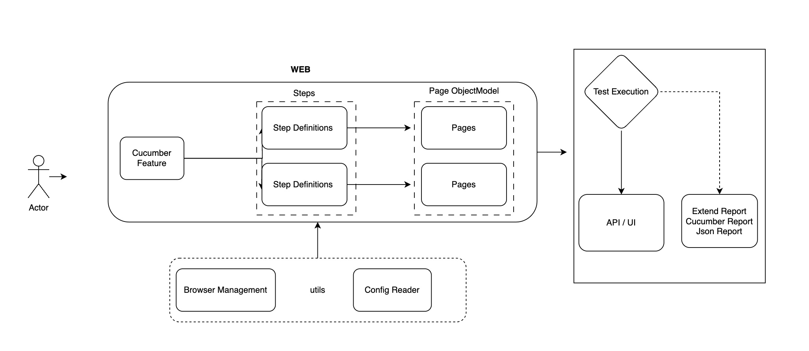
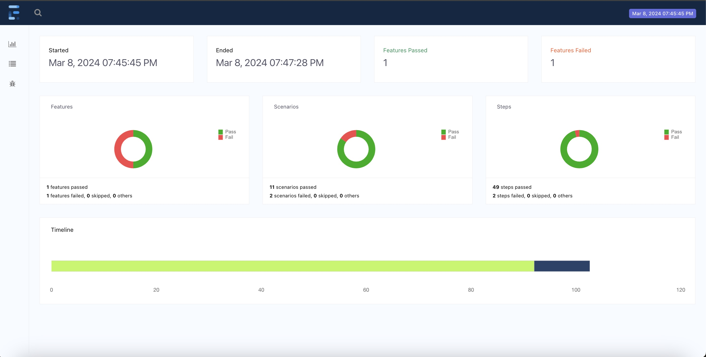

# Automated Functional Tests for techChallenge

### Summary

This repository contains the tests for techChallenge of web application, these tests are developed using Selenium, Cucumber-jvm , TestNG

### Getting Started

Run all tests:

    > mvn clean test

Run UI feature:

    > mvn clean verify -Dtest=TestRunner

Extended HTML report:

Report is generated at `target/extend-report/spark.html`

# Test Framework Code Guidelines

### Specs

These classes are written in [Cucumber](https://cucumber.io/docs/reference#feature) feature files. They should be easily readable and should just contain BDD scenarios. These cucumber file should make a call only to steps.

Example:

```gherkin
@ui
Feature: verify html table with no id

  Scenario: first letter of each word in the title is in upper case excluding the preposition
    Given I launch the application
    When I get all the title from the table with no id
    Then the first letter of each word in the title is in upper case excluding the preposition
```

These tests are written in the BDD format:
- Given = Preconditions for the test (Includes setting up mocks)
- When = Behaviours for the test
- Then = Assertions for the test (Only "Then"s should have assertions)

You can have multiples of each, however, "Given"s are always before all "When"s and "When"s are always before all "Then"s. A good rule of thumb is that all tests should never be more than five lines. If you find you have one longer than five lines, you might want to consider breaking it up into smaller tests.

### Steps Classes

In these classes there should be minimal logic. Here we should only, save values between steps, call methods on Screen Classes, get values from Screen Class methods and assert on them. This is not the place for loops, if statements or finding elements on a page. In addition, steps should never call other steps.

Simple Logic Examples:
- Go to page X
- Remember Y
- Perform action on screen
- Assert Z is Y- etc..

Examples:

```java
@Then("I enter username as {string} and email address as {string}")
public void iEnterUsernameAsAndEmailAddressAs(String name, String email) {
    emailComponent = new EmailComponent();

    emailComponent
            .enterName(name)
            .enterEmail(email);
}
```

### Page Classes

A Page Class/Object is an object-oriented class that serves as an representation of a page in your application. The test steps then use the methods of these page classes whenever they need to interact with the UI of that screen. The benefit is that if the UI changes, the tests themselves don’t need to change, only the code within the Page Class. Subsequently all changes to support the new UI are located in one place.

Page classes should only do these things:
- Store element locators
- Actions (No output)
- Queries (With answers)
- Highly descriptive actions/queries (As directed by demands of Steps Classes)

**They should not include assertions.*

Example:

```java
public class LoginPage extends BasePage {

    private final By entryContent = By.className("entry-content");

    public LoginPage() {
        super();
    }

    public boolean isDisplayed() {
        return isDisplayed(entryContent);
    }
}
```

Web elements in Screen Classes should be private. If a Steps Class needs to access it, it will need to do so via a public method. This stops the Steps Classes from being polluted with driver implementation details.

### Stable Tests

Non-Determinism in tests is worse than not having any tests at all. Before pushing any new tests run them five times in a row without a single fail.

### Code Quality

Code should be clean and kept to the same standard as production code, i.e. no lazy coding - make sure unused imports are removed, code is correctly aligned (IntelliJ - CMD+OPTION+L), with no random newlines and whitespaces. Where possible Java style guidelines should be followed.


### Wait Strategy

Sleeps are bad. Avoid "Thread.sleep(n);" and don't use "waitFor(element)" by default when finding elements. As these slow down the tests dramatically.


### Framework


### Sample Summary Report

#### [Html Report](docs/extend-report/spark.html)

 
